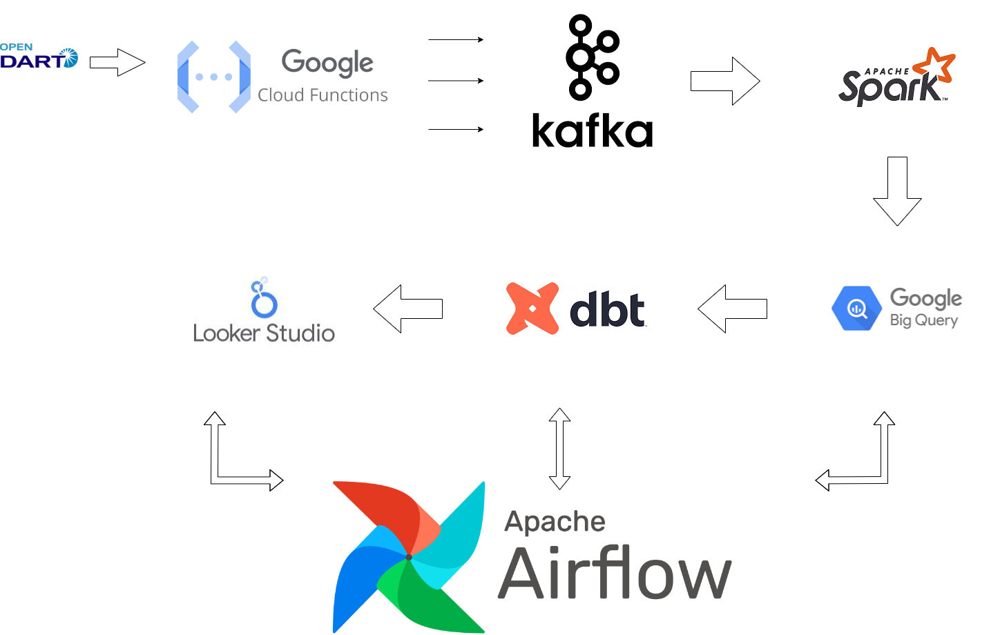

# Data Pipeline using DartAPI
A data pipeline using DartAPI, Kafka Confluent Cloud, Spark on Dataproc, Bigquery

## Table of Contents
- [Description](#description)
- [Prerequisites](#prerequisites)
- [Architecture](#architecture)
- [dbt](#dbt)
  
## Description 
This project utilizes DartAPI to explore various aspects of companies listed on the Korea Market. A Kafka producer sends topics to a Kafka cluster using DartAPI. The received topics are consumed and batch processed by a Dataproc Spark cluster, which transforms JSON-shaped topics into structured dataframes. After transformation, the dataframes are loaded into BigQuery data warehouse and analyzed using dbt. The entire process is orchestrated using the Airflow Scheduler on GKE.

## Prerequisites 
- A GCP account
- A Kafka Confluent Cloud account
- Dataproc Spark Cluster
- Bigquery
- dbt-core
- Airflow on GKE cluster
- Cloud Function

## Architecture 

## dbt 
This project uses dbt to analyze and create models for data in bigquery warehouse. For the repository refer to this [link](https://github.com/dragonhail/dart_dbt).
